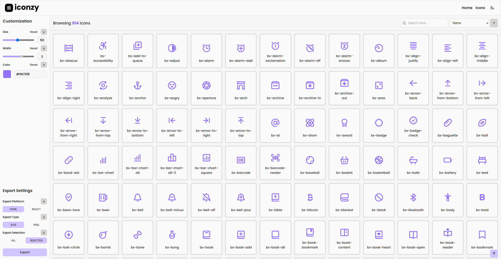

<h1 align="center">Welcome to Iconzy</h1>

<div align="center">
  
  <p>
    <a href="https://www.npmjs.com/package/iconzy" target="_blank">
      
    </a>
    <a href="https://github.com/faustinozanetto/iconzy#readme" target="_blank">
      
    </a>
    <a href="https://github.com/faustinozanetto/iconzy/graphs/commit-activity" target="_blank">
      
    </a>
    <a href="https://github.com/faustinozanetto/iconzy/blob/master/LICENSE" target="_blank">
      
    </a>
    <a href="https://twitter.com/faustinozanetto" target="_blank">
      
    </a>
  </p>
</div>

## ✨ About

Iconzy is a project for customizing and browsing free icon packs for your personal projects.

## 🚀 Installation and Usage

```sh
git clone https://github.com/faustinozanetto/iconzy # First clone the repo in your folder of choice.
cd iconzy # Move into the recently cloned repo.
yarn install # Install using yarn or npm.
yarn dev # Boot up the project using the following command.
```

## 🛠️ Technologies

The project is being developed with the latest technlogoies used in the industry like:

- TurboRepo
- NextJS
- Typescript
- TailwindCSS
- Husky
- ESLint
- Prettier
- React
- And more :)

## 🎛️ Project Structure

The project is a structured in a mono repo so it consists of multiple separated projects. It has two main folders called `apps` and `packages` where the core tools are built.

- `apps/web`: the main [Next.js](https://nextjs.org/) app containing the frontend
- `packages/tsconfig`: the main tsconfig has some files that describe how typescript should work for each app
- `packages/tailwind-config`: the base config for the different uses of tailwindcss across the project
- `packages/eslint-config-custom`: the custom eslint configuration for the project
- `packages/ui`: a React component library containing common UI components like Buttons, Inputs and more

## 👤 Author

**Faustino Zanetto**

- Website: [@faustinozanetto](https://faustinozanetto.vercel.app)
- Twitter: [@faustinozanetto](https://twitter.com/faustinozanetto)
- Github: [@faustinozanetto](https://github.com/faustinozanetto)
- LinkedIn: [@faustinozanetto](https://linkedin.com/in/faustino-zanetto-4294a3213)
